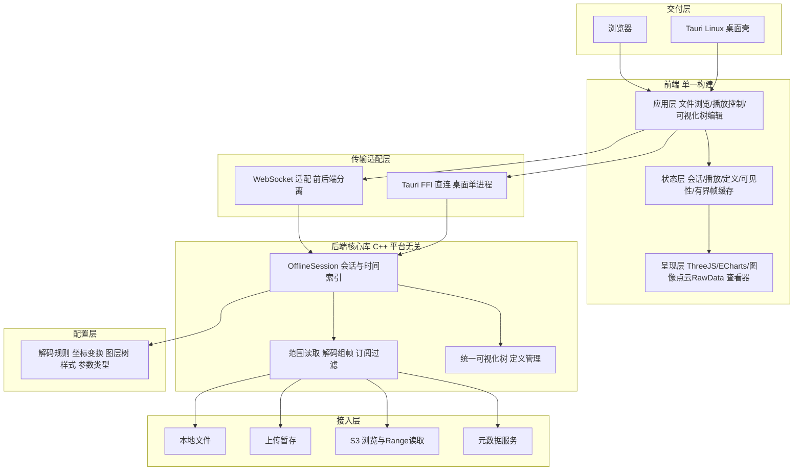
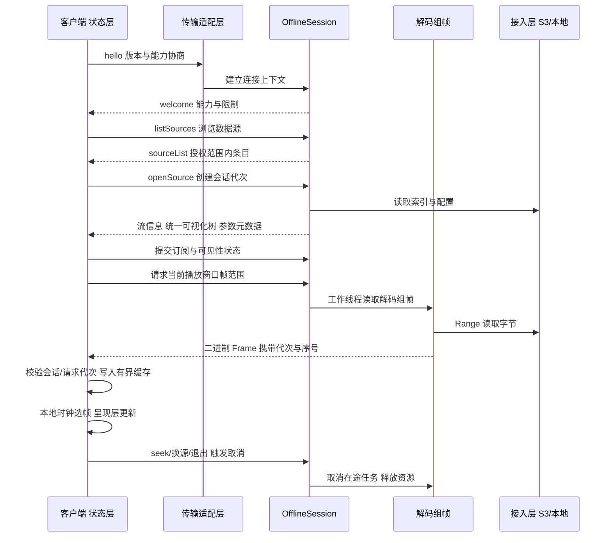
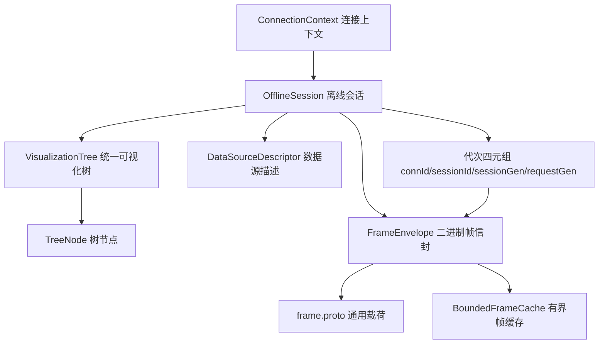

# Three.js Viz 系统设计

## 1. 文档信息

- 文档状态：设计中。
- 需求基线：`requirement.md`，需求内容视为固定输入，本设计不修改需求定义。
- 参考资料：`docs/WEB_ARCHITECTURE.md` 与当前仓库源码。
- 设计目标：给出满足全部 FR、NFR 和 AC 的可实施方案，并建立需求、模块、协议、测试之间的追踪关系。
- 迭代方式：本文档分轮完善；未定项必须明确标记，不以假设冒充已确认结论。

## 2. 范围与事实分级

### 2.1 设计范围

本文覆盖数据源接入、MCAP 解码、帧传输、前端播放、三维渲染、二维图表、统一可视化树、自定义通道与参数、浏览器和桌面交付，以及性能、稳定性和安全设计。

本文不设计自动驾驶算法训练、数据标注、数据修复、地图制作和在线车辆控制能力。

### 2.2 事实分级

为避免把规划能力写成现状，本文使用以下标记：

| 标记 | 含义 |
| --- | --- |
| 已实现 | 已在当前源码中核验到完整主链路 |
| 部分实现 | 已有基础能力，但尚不能满足对应需求的全部条件 |
| 目标设计 | 为满足固定需求而新增或调整的设计 |
| 待确认 | 依赖部署环境、数据样本或量化指标，当前不能单方面确定 |

`docs/WEB_ARCHITECTURE.md` 仅作为参考资料；若其描述与当前源码不一致，以源码核验结果为现状依据，以 `requirement.md` 为目标依据。

### 2.3 外部参考仓库

本设计在整合阶段参考两个外部仓库，二者是能力与实现思路的**现状来源**，不代表本项目已实现的能力：

| 参考仓库 | 角色 | 借鉴内容 | 明确不照搬 |
| --- | --- | --- | --- |
| `x-studio-data` | 数据服务后端（Java、gRPC） | 会话生命周期、控制/数据平面划分、范围点查、帧预热与缓存治理、Java↔C++ 的 HDMap JNI 桥经验 | 语言（Java）、gRPC 为唯一传输、`data_view.proto` 业务视图协议、内部专有与重型依赖 |
| `webmonitor` | 播包前端（React、WebSocket） | 高频帧渲染、Worker 解码、prefetch/session 管理、可配置面板布局、多视图协同 | 直接复制 `data_view.proto` 副本、与本项目冲突的固定协议假设 |

整合目标是取二者能力，落到**单一代码库**、**C++ 后端核心**、**通用 `frame.proto`** 与**双部署形态**上；凡涉及外部仓库的现状描述，均按本节口径处理，不并入“已实现”。

## 3. 设计原则

1. **需求可追踪**：每项设计必须关联 FR、NFR 或 AC，避免无需求来源的功能扩张。
2. **数据含义一致**：浏览器版和桌面版共享数据语义、渲染规则和交互状态模型。
3. **配置驱动**：供应商主题、字段路径、坐标系、几何和样式由配置描述，不在业务代码中写死。
4. **服务与传输解耦**：数据会话、解码和组帧不依赖具体传输实现；WebSocket 为当前传输，保留其他传输适配空间。
5. **按需传输**：图像、点云和 RawData 只在订阅后解码与下发。
6. **状态单一来源**：播放位置、文件代次、节点可见性和定义版本均有唯一权威状态。
7. **资源有界**：缓存、解码队列、网络在途数据和 GPU 资源均设置预算、背压及释放规则。
8. **向后兼容**：协议增加能力时保留旧客户端可识别的基础消息，未知扩展不得破坏核心回放。
9. **默认安全**：凭证只存在于服务端受控环境，TLS 校验默认开启，错误信息不得泄露敏感配置。
10. **故障隔离**：单个通道、参数或渲染器失败不得使整个文件不可用。

## 4. 当前系统基线

### 4.1 当前总体链路

```text
本地文件 / 上传文件 / 已知 S3 对象
  -> C++ 生产后端读取 MCAP、按配置解码并组装 Frame
  -> WebSocket 下发控制元数据与 Protobuf Frame
  -> Web Worker 解码 Frame
  -> 前端内存帧序列与本地播放时钟
  -> Three.js 三维场景 / ECharts 二维图表
  -> 浏览器或 Tauri Linux 桌面壳
```

生产后端由 Bazel 目标 `//server:viz_backend` 构建，入口为 `server/platform/web/server.cpp`。CMake 的 `server/main.cpp` 是演示后端，不作为生产设计基线。

### 4.2 已实现能力

- 本地文件、分块上传以及按已知名称或定位信息打开 S3 对象。
- 后端读取 MCAP、按配置解码、组装通用 `frame.proto` 并通过 WebSocket 推送。
- Worker 池执行 Protobuf 解码，大型数组通过 Transferable 转移。
- Three.js 展示点、线、框、面、文字、箭头和规划轨迹。
- ECharts 展示服务端定义的图表。
- 图像、点云和 RawData 按需订阅及目标时段回填。
- 前端本地时钟主导播放，支持播放、暂停、倍速和 seek。
- 文件或 seek 代次用于隔离过期异步结果。
- 浏览器和 Tauri 复用同一前端构建。

### 4.3 现状缺口

| 需求领域 | 当前状态 | 主要缺口 |
| --- | --- | --- |
| S3 浏览 | 部分实现 | 只能打开已知对象，缺少目录浏览、分页、搜索和权限结果展示 |
| 可视化树 | 部分实现 | 前端根据多类扁平定义组树，缺少服务端统一递归树和编辑协议 |
| 自定义可视化 | 未实现 | 缺少任意通道参数发现、校验、映射和注册流程 |
| 消息协议 | 已对齐 | 前端已补齐类型 9 预取帧常量与分发（复用普通帧解码注入路径），类型 1 至 9 全链路打通 |
| 内存治理 | 不满足 | 当前主链路全量帧驻留内存，缺少强制预算与淘汰策略 |
| S3 安全 | 不满足 | 仓库配置存在长期凭证和关闭 TLS 校验的风险 |
| 点云能力 | 部分实现 | 前端渲染能力已具备，部分后端数据仍是占位透传 |

## 5. 目标总体架构

### 5.1 分层结构

```text
交付层：浏览器部署 | Tauri Linux 桌面
应用层：文件浏览 | 播放控制 | 可视化树 | 自定义可视化编辑
呈现层：Three.js 渲染器 | ECharts 渲染器 | 图像/点云/RawData 查看器
状态层：会话状态 | 播放状态 | 定义状态 | 可见性状态 | 有界帧缓存
协议层：控制消息 | 定义消息 | Frame 数据消息 | 错误与能力协商
服务层：OfflineSession | 范围读取 | 解码组帧 | 订阅过滤 | 定义管理
接入层：本地文件 | 上传暂存 | S3 浏览与对象读取 | 元数据服务
配置层：解码规则 | 坐标变换 | 图层树 | 样式 | 参数类型规则
```

### 5.2 目标架构图

上述分层的模块关系与两种部署形态如下（同一套后端核心库，仅传输适配不同）：



分离部署走 WebSocket 适配、桌面部署走 FFI 直连，二者接入同一后端核心库，见 ADR-08。

### 5.3 核心边界

- **接入层**只负责定位、授权和读取字节，不解释业务字段。
- **服务层**负责会话、时间索引、解码、坐标处理、组帧和订阅过滤。
- **协议层**只表达跨端契约，不承载 UI 组件实现细节。
- **状态层**维护前端唯一播放位置、代次、缓存预算和统一可见性。
- **呈现层**通过统一渲染器接口消费已验证数据，不直接访问 S3 或 MCAP。
- **应用层**组织用户流程，不复制解码、坐标或样式规则。

### 5.4 数据流

主链路的运行时数据流如下（控制平面与帧数据平面分离，见 ADR-03）：



分步说明：

1. 客户端建立连接并完成协议版本与能力协商。
2. 服务端下发数据源能力和当前用户可访问范围。
3. 用户选择本地、上传或 S3 文件，服务端创建新的离线会话代次。
4. 服务端解析索引和配置，下发流信息、统一可视化树及可发现参数元数据。
5. 客户端提交订阅和可见性状态，服务端只解码必要通道。
6. 客户端按当前播放窗口请求帧范围，服务端在工作线程读取、解码并发送。
7. Worker 解码 Frame，状态层校验会话代次和请求代次后写入有界缓存。
8. 播放时钟选择当前时间对应帧，呈现层更新 Three.js、ECharts 和其他查看器。
9. 切换文件、取消订阅或退出时，双方取消在途任务并释放 CPU、内存、文件和 GPU 资源。

### 5.5 核心数据结构设计

本节汇总跨端契约的关键数据结构，作为各详细章节的索引；字段级定义以对应章节为准。

#### 5.5.1 结构关系总览



#### 5.5.2 关键结构清单

| 结构 | 职责 | 关键字段 | 详见 |
| --- | --- | --- | --- |
| `DataSourceDescriptor` | 显式描述数据来源，取代语义过载的单一 `source` 字符串 | `sourceType`、`sourceId`、`displayName`、`locator` | 8.2 |
| 控制消息信封 | 统一控制平面请求/响应关联与代次隔离 | `type`、`requestId`、`sessionId`、`sessionGeneration`、`requestGeneration`、`payload` | 9.3 |
| 代次四元组 | 隔离过期异步结果的权威标识 | `connectionId`、`sessionId`、`sessionGeneration`、`requestGeneration` | 9.4 |
| `FrameEnvelope`（二进制头） | 帧数据平面的定长头，与 `frame.proto` 载荷分离 | `messageType`、`headerVersion`、`flags`、`sessionGeneration`、`requestGeneration`、`sequence`、`payloadLength` | 9.6 |
| `frame.proto` 载荷 | 通用几何/图表/图像/点云/RawData 内容，snake_case | 通用载荷字段，业务语义靠配置+树表达 | ADR-02、ADR-09 |
| `VisualizationTree` / `TreeNode` | 可见性唯一来源的递归树 | `treeId`、`revision`、`schemaVersion`、`nodes[]`（`id`/`parentId`/`kind`/`renderer`/`binding`/`availability`/`capabilities`） | 11.2 |
| 有界帧缓存 | 字节预算硬上限的播放窗口缓存 | 帧数上限、字节硬上限、播放窗口优先、可观察指标 | ADR-05、9.7 |
| 结构化错误信封 | 统一控制面失败表达 | `code`、`message`、`retryable`、`details` | 8.6 |

#### 5.5.3 设计约束

- **代次贯穿**：控制信封、二进制帧头、缓存写入均携带 `sessionGeneration` 与 `requestGeneration`，任何写入前须与当前状态比对，过期结果丢弃。
- **控制与载荷分离**：控制元数据只在信封/二进制头，不复制进 `frame.proto` 每个业务字段。
- **稳定标识**：`sourceId`、`TreeNode.id` 为服务端签发的不透明稳定 ID，显示名/顺序/父节点变化不影响标识，也不泄露真实路径与凭证。
- **有界性**：帧缓存与各队列均以字节/条数双上限约束，禁止无界增长。

## 6. 核心架构决策

### ADR-01 生产后端以 Bazel 链路为唯一产品基线

- 决策：产品构建、测试和发布均使用 `//server:viz_backend`；演示后端仅用于最小示例。
- 原因：生产入口具备真实 MCAP、S3、配置解码和 WebSocket 链路。
- 关联：FR-01、FR-02、FR-08，AC-01、AC-09。

### ADR-02 保持通用 Frame 作为数据内容协议

- 决策：继续使用可扩展 `frame.proto` 表达几何、图表、图像、点云和 RawData，不引入业务专用的固定视图协议。
- 原因：满足多供应商、配置扩展和自定义可视化的数据兼容要求。
- 约束：前端解析必须保留 snake_case 字段；协议副本必须由自动校验防止漂移。
- 关联：FR-02、FR-03、FR-07，NFR-03-04。

### ADR-03 控制平面与帧数据平面分离

- 决策：文件浏览、定义、订阅、seek 和错误属于控制平面；高频 Frame 属于二进制数据平面。
- 原因：两类消息在频率、可靠性、扩展方式和背压策略上不同。
- 关联：FR-01、FR-05、FR-06、FR-07，NFR-02。

### ADR-04 统一可视化树是可见性的唯一来源

- 决策：服务端提供带稳定 ID 和版本的递归树；三维、二维及用户自定义项均注册为树节点。
- 原因：消除多套开关状态，保证父子三态传播和跨呈现类型的一致行为。
- 关联：FR-06-06 至 FR-06-09，AC-12。

### ADR-05 前端缓存改为有界窗口

- 决策：以字节预算为硬限制，结合播放窗口、最近访问和数据优先级淘汰帧；seek 未命中时重新请求。
- 原因：当前全量内存缓存无法满足长时数据资源上限。
- 约束：不得因淘汰改变当前播放位置；缓存范围必须在时间轴上可观察。
- 关联：FR-05，NFR-01-02，NFR-02-01，AC-04、AC-07。

### ADR-06 S3 仅由服务端访问

- 决策：浏览器和 WebView 不接收长期密钥，不直接调用 S3；服务端基于用户身份执行浏览和 Range 读取。
- 原因：避免凭证泄露、跨域差异和客户端权限绕过。
- 关联：FR-01-06、FR-01-07，NFR-03-03，AC-11。

### ADR-07 后端核心采用 C++（对比 Java 与 Rust）

- 决策：数据服务后端核心以 **C++** 实现，作为跨部署共享的单一核心库。
- 选型对比：

| 维度 | C++（采用） | Java（`x-studio-data` 现状） | Rust |
| --- | --- | --- | --- |
| 现有资产复用 | 直接复用现仓库 C++ 后端主链路、`frame.proto` 组帧、MCAP/S3/HEVC 解码，无需跨语言桥 | 需保留 JNI 桥调用 C++ HDMap，跨语言维护成本高 | 需重写现有 C++ 主链路，或经 FFI 包装，迁移量大 |
| 桌面动态库直连 | 天然可编译为 C 接口动态库，供 Tauri 经 FFI 进程内调用 | 需内嵌 JVM，桌面单进程与体积代价高 | 可导出 C ABI，但要重写核心 |
| 高频帧性能与内存控制 | 手动内存与零拷贝控制成熟，契合有界缓存与背压预算 | GC 停顿对 30ms/帧高频链路不友好 | 性能与安全俱佳 |
| 依赖与维护 | 依赖 Bazel + 成熟公开库（protobuf/FFmpeg/zstd），符合极简依赖原则 | 生态成熟但重型运行时不满足桌面单进程诉求 | 生态较新，团队现有 C++ HDMap/解码资产复用弱 |
| 主要风险 | 内存安全需靠规范与工具约束 | 双运行时与桥接复杂度 | 迁移成本与团队熟悉度 |

- 原因：本项目已有 C++ 后端主链路与 HEVC/MCAP/S3 解码资产，且桌面模式要求由 Tauri 直接加载后端动态库（见 ADR-08）；C++ 在资产复用、FFI 直连和高频性能上综合最优。Java 的 JVM 运行时与 Rust 的重写成本均不利于“单一核心库 + 桌面单进程”目标。
- 约束：核心库须与传输、平台无关；内存安全依赖统一的所有权与资源释放规范，并以工具（sanitizer、静态检查）兜底。
- 关联：FR-08，NFR-01、NFR-02，AC-08、AC-09。

### ADR-08 单后端核心库 + 传输适配层统一两种部署

- 决策：将会话、时间索引、解码组帧、订阅过滤、定义管理沉淀为**平台无关的 C++ 后端核心库**；部署差异只落在其外的**传输适配层**。
  - **前后端分离部署**：核心库运行在独立后端进程，经 WebSocket 传输适配对外服务，前端与桌面壳均以网络客户端接入。
  - **桌面部署**：Tauri 壳经 **FFI 直接加载后端核心动态库**，在同一进程内建立会话，不再单独启动后端进程；前端通过本地桥接调用与网络客户端等价的会话接口。
- 原因：满足 FR-08-06“桌面单一应用、无需单独启动后端”，同时保证两种形态共享同一份会话与解码逻辑，杜绝双实现漂移。
- 约束：核心库对外暴露稳定的会话 API（打开/关闭、元数据、控制、帧范围、订阅）；传输适配层只做编解码、分帧、背压与鉴权，不重复业务逻辑；桌面 FFI 与 WebSocket 两条路径必须复用同一序列化契约。
- 关联：FR-08-01 至 FR-08-07，NFR-02，AC-08、AC-09、AC-14。

### ADR-09 以 frame.proto 取代 data_view.proto 并支持自定义可视化映射

- 决策：数据内容协议统一为通用可扩展的 `frame.proto`，**不引入** `x-studio-data`/`webmonitor` 中的业务专用 `data_view.proto`。
- 简化与扩展方式：
  - `frame.proto` 只表达通用几何、图表、图像、点云和 RawData 载荷，业务语义（障碍物、红绿灯、车辆等）通过**配置 + 统一可视化树节点**表达，而非在协议中固化业务字段。
  - 用户自定义显示 topic / 字段路径 / 样式（FR-07-09～FR-07-11）由服务端**配置驱动映射**：将任意通道字段抽取为通用载荷并注册为可见性树节点，前端据节点定义选择三维或二维呈现。
  - `data_view.proto` 中的既有业务对象作为**迁移映射来源**：为其定义到 `frame.proto` 通用载荷 + 样式配置的转换，保证 OCC/BEV/HEVC 图像等能力在简化协议下不丢失。
- 原因：满足多供应商兼容与用户自定义可视化，避免协议随业务无界膨胀，并与 ADR-02、ADR-04 保持一致。
- 约束：前端解析保留 snake_case 字段；协议副本由自动校验防漂移；迁移期须提供 `data_view` → `frame` 的对照与验证用例。
- 关联：FR-02-06、FR-07-09 至 FR-07-11，AC-01、AC-13。

## 7. 需求追踪总表

| 需求组 | 主要设计章节 | 验收入口 |
| --- | --- | --- |
| FR-01 数据加载 | 第 5 章目标架构、第 8 章数据源与 S3 浏览 | AC-01、AC-10、AC-11 |
| FR-02 数据兼容 | ADR-02、ADR-09、第 8.2 节数据源描述、后续配置与元数据设计 | AC-01、AC-10、AC-13 |
| FR-03 三维展示 | 第 4 章当前基线、后续呈现层设计 | AC-02、AC-03 |
| FR-04 坐标时序 | 后续坐标与采样时间设计 | AC-02、AC-03 |
| FR-05 播放时间轴 | ADR-03、ADR-05、第 9 章会话与协议兼容 | AC-04、AC-05、AC-07 |
| FR-06 图层通道 | ADR-04、第 9.7～9.8 节、第 11 章统一递归可视化树 | AC-02、AC-06、AC-12 |
| FR-07 多模态与自定义 | ADR-09、第 11 章统一节点、订阅与运行时联动、第 9.4 节 `subscribeRaw` 原始数据字节流（前端解码），后续参数发现和渲染器设计 | AC-06、AC-12、AC-13、AC-15 |
| FR-08 交付 | 第 5 章分层结构、ADR-07、ADR-08、后续部署设计 | AC-08、AC-09、AC-14 |
| NFR-01 | 第 9.8 节资源上限、第 10.4～10.5 节资源防护与门禁、第 11.7 节树资源限制 | AC-05、AC-07 |
| NFR-02 | 第 9.5～9.8 节代次、取消与背压，第 11.4～11.5 节树并发和生命周期 | AC-04、AC-07、AC-10 |
| NFR-03 | ADR-06、第 8.4～8.6 节授权与错误、第 9.2～9.6 节兼容、第 10 章安全门禁、第 11.6～11.7 节树持久化与安全 | AC-08、AC-10、AC-11、AC-12 |

## 8. 数据源与 S3 浏览设计

### 8.1 现状与目标边界

- **已实现**：本地路径、上传文件、已知 `s3://bucket/key`、`bucket/key` 或 record 可进入统一 MCAP 读取链路；S3 对象通过 `HEAD` 与 Range `GET` 提供随机读取。
- **未实现**：当前 S3 客户端没有对象枚举接口，文件列表只覆盖本地上传目录，因此“可打开已知对象”不等于“可浏览 S3”。
- **目标设计**：新增服务端受控浏览 API，仅返回当前用户有权访问的虚拟目录和 MCAP 对象；选中对象后继续复用现有 Range 读取，不下载完整对象。

### 8.2 显式数据源描述

控制协议不再以语义过载的单个 `source` 字符串区分来源，统一使用 `DataSourceDescriptor`：

```json
{
  "sourceType": "s3Object",
  "sourceId": "opaque-server-issued-id",
  "displayName": "2026-09-07-drive.mcap",
  "locator": {
    "bucketAlias": "authorized-root-a",
    "objectKey": "records/2026/09/07/drive.mcap"
  }
}
```

`sourceType` 取值及约束：

| 类型 | 定位信息 | 使用范围 | 客户端可见性 |
| --- | --- | --- | --- |
| `localFile` | 服务端签发的文件 ID | 桌面端或受控本地部署 | 不返回真实绝对路径 |
| `uploadedFile` | 上传完成后的文件 ID | 浏览器与桌面端 | 不返回暂存目录 |
| `s3Object` | 根别名、对象键或不透明 `sourceId` | 在线数据 | 不返回 endpoint 和凭证 |
| `recordRef` | record 标识 | 元数据服务可用时 | 服务端解析 bucket/key |

服务端必须按 `sourceType` 做结构化校验，不再通过“本地文件是否存在”推断 S3。兼容期可继续接收旧 `source` 字段，但应转换为内部描述并记录弃用指标。

### 8.3 S3 浏览接口

浏览请求属于控制平面，最小请求如下：

```json
{
  "type": "listSources",
  "requestId": "uuid",
  "sourceType": "s3Object",
  "rootId": "authorized-root-a",
  "prefix": "records/2026/09/",
  "delimiter": "/",
  "pageSize": 100,
  "continuationToken": "opaque-token",
  "filter": { "suffix": ".mcap", "nameContains": "drive" }
}
```

响应返回虚拟目录和对象，不返回密钥、内部 endpoint 或未经授权的 bucket 信息：

```json
{
  "type": "sourceList",
  "requestId": "uuid",
  "rootId": "authorized-root-a",
  "prefix": "records/2026/09/",
  "entries": [
    { "kind": "prefix", "id": "opaque-id", "name": "07/" },
    { "kind": "object", "id": "opaque-id", "name": "drive.mcap", "size": 1234 }
  ],
  "nextContinuationToken": null,
  "isTruncated": false
}
```

设计规则：

1. 服务端代理 S3 `ListObjectsV2`，使用 `prefix`、`delimiter`、`max-keys` 和 continuation token；客户端不得直接访问 S3。
2. `rootId` 映射到服务端配置的允许根，客户端不能提交任意 bucket 或 endpoint。
3. 默认仅返回 `.mcap` 对象；搜索首期限定为当前授权根下的名称或前缀过滤，不承诺全局全文检索。
4. `pageSize` 由服务端限制在配置上限内；continuation token 必须不透明、带作用域并可校验篡改。
5. 页面内按“目录优先、名称稳定升序”展示；跨页顺序以对象存储返回游标为准，不用 offset 模拟分页。
6. 对象变化导致分页快照不一致时，响应携带 `listingVersion` 或重新浏览提示，不静默拼接错误结果。
7. 选中对象时客户端提交条目 `id`；服务端再次鉴权并解析真实 bucket/key，不能信任客户端回传的显示字段。
8. 对象大小、修改时间和 ETag 仅作展示与一致性校验；不得把 ETag 当作访问凭证。

### 8.4 授权、审计与最小权限

- 身份认证由部署环境提供；浏览服务接收已验证的主体，不接受客户端自报用户 ID。
- 授权在“列举”和“打开”两个阶段分别执行，避免列表结果过期后被越权打开。
- 服务账号只授予允许根的 `ListBucket`、`GetObject` 与必要的 `HeadObject` 权限，不授予写入和删除权限。
- 日志记录主体、授权根、对象不透明 ID、操作、结果、延迟和请求 ID；不得记录密钥、签名头或完整敏感 URL。
- 桌面离线模式没有在线身份时，不得自动回退到仓库内置凭证；在线能力应明确显示为不可用。

### 8.5 Range 读取与一致性

打开对象后先执行 `HEAD`，记录长度、ETag 和最后修改时间。后续 Range 请求应带一致性条件；对象在会话中发生变化时终止当前会话并返回 `SOURCE_CHANGED`，不得把不同版本字节拼成同一个 MCAP。网络读取增加连接、响应和总请求超时，并对 DNS、连接失败、限流和 5xx 采用有上限的指数退避；鉴权失败、对象不存在、校验失败和无效 Range 不重试。

目标实现保留 `RandomAccessReader` 边界，并在其下增加连接复用和并发上限。相邻小 Range 可合并，但不得绕过会话取消、对象版本校验和全局字节预算。

### 8.6 结构化错误模型

所有控制面失败使用统一错误信封：

```json
{
  "type": "error",
  "requestId": "uuid",
  "sessionId": "optional-session-id",
  "code": "SOURCE_ACCESS_DENIED",
  "message": "无权访问所选数据",
  "retryable": false,
  "details": { "operation": "openSource" }
}
```

稳定错误码至少包括：`INVALID_REQUEST`、`AUTH_REQUIRED`、`SOURCE_ACCESS_DENIED`、`SOURCE_NOT_FOUND`、`SOURCE_CHANGED`、`LISTING_EXPIRED`、`UPSTREAM_TIMEOUT`、`UPSTREAM_THROTTLED`、`META_LOOKUP_FAILED`、`UNSUPPORTED_SOURCE`、`MCAP_INVALID` 和 `INTERNAL_ERROR`。用户消息应可理解，诊断细节通过请求 ID 关联服务端日志；响应不得携带真实凭证、签名、内部路径和上游响应正文。

### 8.7 与需求及验收的关系

- 覆盖：FR-01-02、FR-01-04 至 FR-01-07、FR-02-05、NFR-03-01、NFR-03-03。
- 验收：AC-10、AC-11。
- 必测场景：空目录、多页目录、无权限根、对象打开前被删除、分页中对象变化、限流重试、超时取消、特殊字符对象键及非 MCAP 对象过滤。

## 9. 会话模型与协议兼容设计

### 9.1 现状与迁移目标

当前控制面使用 JSON，帧数据使用“1 字节消息类型 + 二进制载荷”。服务端发送类型 `9` 的预取帧并接受 `startPrefetch`；前端已补齐类型 `9` 的常量与分发（封包同普通帧，解码后同样注入内存滑窗），协议断点已消除，类型 `1` 至 `9` 全链路对齐。当前服务端还是单全局活动会话，新连接会影响旧连接，不能满足连接隔离。

目标是在不改变 `frame.proto` 数据语义的前提下，为控制面补充握手、能力、会话和请求关联；二进制消息保留类型头并通过能力协商扩展。

### 9.2 连接握手与版本协商

WebSocket 建立后，客户端首先发送：

```json
{
  "type": "hello",
  "requestId": "uuid",
  "protocol": { "major": 1, "minor": 1 },
  "capabilities": [
    "prefetch-frame-v1",
    "s3-browser-v1",
    "visualization-tree-v1",
    "structured-error-v1"
  ]
}
```

服务端返回双方交集及限制：

```json
{
  "type": "welcome",
  "requestId": "uuid",
  "protocol": { "major": 1, "minor": 1 },
  "capabilities": ["prefetch-frame-v1", "s3-browser-v1"],
  "limits": {
    "maxControlMessageBytes": 262144,
    "maxPageSize": 200,
    "maxInFlightRequests": 16
  }
}
```

兼容规则：

1. `major` 不兼容时拒绝进入业务流程并返回 `PROTOCOL_VERSION_UNSUPPORTED`。
2. `minor` 允许向后兼容；仅启用双方声明的能力，不能仅凭版本号猜测能力。
3. 服务端在迁移期允许未发送 `hello` 的旧客户端进入 `legacy-v1`，但不得向其发送类型 `9` 或其他未声明扩展。
4. 客户端遇到未知的可选控制消息或二进制类型时记录一次诊断并忽略；只有声明为必需但无法处理的能力才终止连接。
5. 所有消息均设置大小上限、JSON 深度上限和字段类型校验，非法消息只影响对应请求；重复恶意消息可关闭连接。

### 9.3 控制消息信封

业务请求统一携带以下字段：

```json
{
  "type": "seek",
  "requestId": "uuid",
  "sessionId": "uuid",
  "sessionGeneration": 4,
  "requestGeneration": 12,
  "payload": { "timeSec": 18.5 }
}
```

- `requestId`：连接内唯一，用于响应、错误、取消和日志关联。
- `sessionId`：一次已打开数据源的逻辑会话标识，不复用旧值。
- `sessionGeneration`：换源或重新打开时递增，隔离旧文件结果。
- `requestGeneration`：seek、范围请求或订阅重建时递增，隔离同一文件内的旧请求。
- `payload`：具体业务参数；迁移期允许旧消息保留顶层字段，服务端统一规范化。

响应必须回显 `requestId`。同一 `requestId` 的重试应具备幂等语义：只读请求可重放；改变播放状态的请求由服务端保存短期去重结果，避免网络重试执行两次。

### 9.4 接口方法总览（RPC / 消息面）

本节把散落在握手、控制信封、帧信封中的交互收敛为一组稳定的接口方法，作为传输无关的服务契约。设计参考外部仓库 `x-studio-data` 的 `DataService`（gRPC），但按本项目的双部署（WebSocket / FFI）与既有 `frame.proto` 数据语义做了收敛（见 ADR-03、ADR-08、ADR-09）。

#### 9.4.1 设计要点

- **传输无关的方法集**：同一组逻辑方法在 WebSocket 下映射为控制消息 `type`，在 Tauri/FFI 下映射为进程内命令；两种部署共享同一后端核心库实现，仅接入层不同。
- **统一控制入口**：会话状态变更（seek / play / 渲染配置）收敛为单一 `controlSession` 方法（对应 `x-studio-data` 的 `ControlSession` oneof），避免为每个动作单开一条 RPC。
- **控制面与数据面分离**：帧数据不走请求/响应，而由 `readFrames` 建立的下行帧流承载二进制帧信封；控制方法只负责会话与游标（见 ADR-03）。
- **代次贯穿**：除握手/浏览外，所有方法请求与帧流消息均携带 `sessionGeneration` / `requestGeneration`，过期结果一律丢弃（见 9.3、9.5）。

#### 9.4.2 方法清单

| 方法 | 方向/模式 | 入参（要点） | 出参（要点） | 说明 |
| --- | --- | --- | --- | --- |
| `hello` / `welcome` | 请求/响应 | 协议版本、能力集 | 交集能力、连接限制 | 版本与能力协商，见 9.2 |
| `listSources` | 请求/响应 | 浏览路径、分页游标 | `DataSourceDescriptor[]`、下一页游标 | S3/本地数据源浏览，见 8.3 |
| `openSource` | 请求/响应 | `DataSourceDescriptor`、初始配置 | `sessionId`、`sessionGeneration`、流信息、可视化树、参数元数据 | 建立会话代次，见 8.2、9.5、11.2 |
| `getMeta` | 请求/响应 | `sessionId` | 时长、通道、片段、可用参数 | 会话元数据查询 |
| `controlSession` | 请求/响应 | `sessionId` + oneof：`seek` / `playControl` / `updateRenderConfig` | 受理结果、实际落点、当前播放状态 | 统一状态入口；触发帧流内边界通知 |
| `readFrames` | 下行帧流（长连接） | 订阅通道、可见性、`timeRange`、代次 | 二进制帧信封流 + 内联通知（SeekAck/PlayAck/EOS/Warning/Error） | 会话内建立一次，控制面驱动，见 9.6 |
| `fetchRange` | 请求/响应 | `sessionId`、`timeRange`、`maxFrames` | 帧集合、下一时间戳、状态/错误码 | 随机点查/预取回填，见 9.7 |
| `subscribeRaw` | 下行二进制流（可开关） | `sessionId`、目标 `topic`、代次 | 该 topic 最新消息的原始序列化字节（protobuf 原样透传）+ 时间戳 | 实时原始数据查看；后端不做序列化，前端用 protobufjs 按 topic 类型解码为 JSON；查找/分页/树状展示均在前端，见 9.7 |
| `closeSource` | 请求/响应 | `sessionId`、关闭原因 | 成功标志 | 释放会话资源，触发在途任务取消，见 9.5 |

#### 9.4.3 WebSocket 与 FFI 映射

- **WebSocket**：控制方法用 JSON 控制信封（9.3）承载，`type` 取方法名（如 `controlSession`）；`readFrames` 的下行帧走二进制帧信封（9.6）。参考 `x-studio-data` 的 `DataServiceRequest` / `DataServiceResponse` oneof 包装思路，本项目以 `type` 字段区分而非 protobuf oneof，避免手动分帧。
- **FFI（Tauri 桌面）**：每个控制方法映射为一个进程内命令；帧流通过回调/共享队列回传，无需网络分帧。语义与 WebSocket 一一对应，仅省去序列化与连接管理（见 ADR-08）。
- **差异约束**：接入层差异只落在传输与数据源接入方式上，方法集、代次语义、错误模型（8.6）在两种部署中保持一致。

### 9.5 连接、会话与请求生命周期

目标服务端按连接维护 `ConnectionContext`，其中可有一个活动 `OfflineSession`；不同连接之间不得共享可变播放、订阅、预取和发送队列状态。认证主体可同时拥有的连接与会话数量由配置限制。

生命周期规则：

1. `openSource` 成功后生成新的 `sessionId` 和 `sessionGeneration`，旧会话进入取消态。
2. `seek` 生成新的 `requestGeneration`，取消旧范围读取、旧预取和旧解码结果，但不改变数据源会话。
3. 每个异步任务捕获四元组 `(connectionId, sessionId, sessionGeneration, requestGeneration)`；提交结果前再次比较当前状态。
4. 换源、断开连接和应用退出均先触发取消令牌，再等待有上限的任务收敛，最后释放解码器、文件句柄、缓存和发送队列。
5. 断线重连默认创建新连接和新会话，不接受旧连接迟到数据；如未来支持恢复，必须使用服务端签发且短期有效的恢复令牌。
6. 服务端的现有 `generation` 可作为迁移期内部字段，但不能继续把它同时表示文件代次、请求代次和二进制序号。

### 9.6 二进制帧信封

新协议的二进制头应显式包含以下逻辑字段：消息类型、头版本、标志、`sessionGeneration`、`requestGeneration`、序号和载荷长度。多字节字段统一网络字节序，并对头长度和载荷长度做边界校验。`frame.proto` 仍作为载荷，不复制控制元数据到每个业务字段。

迁移顺序：

1. 前端先支持旧头的类型 `9`，修复现有断点。
2. 双端增加 `binary-envelope-v2` 能力和新头解析器。
3. 协商成功时使用新头；否则继续发送旧头类型 `1` 至 `8`，且只在声明 `prefetch-frame-v1` 后发送类型 `9`。
4. 指标确认旧客户端退出支持范围后，再移除旧头编码。

### 9.7 预取与类型 9 语义

`startPrefetch` 必须带 `sessionId`、代次、可选时间范围和字节预算。服务端返回 `prefetchStarted`，持续发送类型 `9` 预取帧，并周期性发送进度：

```json
{
  "type": "prefetchProgress",
  "requestId": "uuid",
  "sessionId": "uuid",
  "requestGeneration": 12,
  "processedFrames": 800,
  "storedFrames": 798,
  "failedFrames": 2,
  "bytesSent": 73400320,
  "complete": false
}
```

- 实时类型 `1` 以低延迟优先，发送队列满时允许丢弃并累计指标。
- 预取类型 `9` 以完整性优先，背压时重试同一帧，但受取消、超时、重试次数和总字节预算约束。
- 客户端只有在目标持久层或有界缓存写入成功后才计入 `storedFrames`；接收 WebSocket 消息不代表已缓存。
- 源读取失败不得静默跳过。结束消息必须给出成功、部分成功、取消或失败状态，以及失败帧索引或压缩区间。
- “完整缓存”定义为请求范围内所有可读取帧均写入成功，失败清单为空，且结束消息中的源版本与打开时一致。
- 预取帧默认不包含未订阅的大载荷；若用户请求离线完整包，必须显式声明内容集合并重新预算。

### 9.8 顺序、背压与资源上限

每个连接分别维护控制队列、实时帧队列和预取队列。控制消息优先；实时队列采用有界覆盖或丢弃；预取队列采用有界阻塞与取消感知。任何队列均不得无限增长。限制至少包括：连接数、每主体会话数、在途请求数、队列消息数、队列字节数、单消息大小、预取总字节和任务截止时间。

服务端帧缓存由现有 128 帧固定容量升级为“帧数上限 + 字节硬上限”双约束；前端缓存同样以字节为权威预算，并优先保留当前播放窗口。超过预算时应产生可观察指标，不允许退化为无界累积。

### 9.9 与需求及验收的关系

- 覆盖：FR-01-04、FR-01-05、FR-05、FR-06-03 至 FR-06-05、NFR-01、NFR-02、NFR-03-04。
- 验收：AC-04 至 AC-07、AC-10。
- 必测场景：新旧客户端组合、未知消息、类型 `9`、连续 seek、预取中换源、断线重连、慢客户端、重复请求、畸形长度头、两连接并发和缓存预算耗尽。

## 10. 安全整改与发布门禁

### 10.1 已确认的阻断风险

当前源码及配置中存在长期 S3 凭证，配置默认关闭 TLS 证书校验，元数据查询仅支持明文 HTTP。这些不是一般优化项，而是发布阻断项；在完成整改前，不得将在线数据能力发布到共享或生产环境。

### 10.2 凭证治理

1. 立即吊销并轮换仓库中出现过的 Access Key 与 Secret Key；仅从工作树删除不足以消除泄露影响。
2. 清理 Git 历史、构建缓存、发布产物和日志中的凭证，并执行全仓库及产物秘密扫描。
3. 删除代码中的默认凭证和解析失败回退逻辑。缺少凭证、凭证格式错误或身份服务不可用时必须显式启动失败，或禁用在线能力。
4. 部署优先使用工作负载身份或短期凭证；必须使用密钥时，通过受控密钥管理服务或进程环境注入，禁止进入前端、配置模板和安装包。
5. 凭证权限限定到授权根的只读操作，并建立轮换、过期和撤销流程。

### 10.3 传输与上游安全

- S3 客户端默认且强制执行证书链和主机名校验；自定义 CA 必须显式配置，禁止静默切换到 `verify_none`。
- 元数据服务迁移到 HTTPS，并支持服务身份认证、请求超时和响应大小限制。迁移前若必须临时使用 HTTP，只允许在隔离网络内启用显式风险开关，并阻止生产发布配置误用。
- WebSocket 的远程部署使用 WSS；桌面端回环连接可使用 WS，但必须限制监听地址、校验 Origin，并避免暴露到外部接口。
- URL、对象键和 record 标识均做规范化与 RFC 3986 编码；禁止把用户输入直接拼接到请求行。
- 上游错误正文、签名信息、内部 endpoint、绝对路径及堆栈不得返回客户端。

### 10.4 输入与资源防护

- 对上传大小、文件扩展名、MCAP 结构、JSON 深度、Protobuf 长度、字段数量和递归树深度设置上限。
- 上传暂存文件使用随机服务端 ID；文件名仅作显示，不能参与路径拼接。
- Range、seek、列表和预取请求执行速率限制、并发限制与取消；解析压缩数据时设置解压后大小上限。
- 自定义可视化定义只允许声明式 schema，不执行用户脚本、表达式代码或任意模块 URL。
- 日志采用结构化脱敏；审计日志与运行日志分离，并设置保留期限和访问控制。

### 10.5 发布门禁

在线数据能力发布前必须全部通过：

- 仓库历史、工作树、构建产物和容器镜像秘密扫描为零高危结果；
- 已泄露凭证完成轮换并验证旧凭证失效；
- S3 与元数据服务 TLS 校验测试通过，错误证书和主机名不匹配均被拒绝；
- 最小权限策略通过越权列表、越权打开和跨根 token 重放测试；
- 前端包、WebSocket 消息和错误响应中不存在凭证、内部路径及敏感 endpoint；
- 资源上限和限流配置有生产默认值，压力测试中无无界内存或队列增长。

覆盖 NFR-01-02、NFR-02-03、NFR-03-03 与 AC-07、AC-10、AC-11。

## 11. 统一递归可视化树设计

### 11.1 现状与目标

当前服务端分别下发图层、图表和图像定义，前端再以不同状态容器维护显隐或订阅；图层面板只支持“分组—叶子”两级结构，并含固定分组顺序和 `boundary_*` 聚合规则。该实现已做到图层定义配置化，但尚未满足任意层级、全部可视化类型统一接入、服务端提供完整树以及用户修改可演进的要求。

目标是由服务端下发一棵统一的 `VisualizationTree`：三维图层、二维图表、图像、点云、RawData 和用户自定义可视化均作为同一树中的节点；前端只负责递归呈现、交互和向对应运行时投递状态，不再根据业务名称拼装树。

### 11.2 节点模型

```json
{
  "treeId": "main",
  "revision": 27,
  "schemaVersion": 1,
  "nodes": [
    {
      "id": "group/sensors",
      "parentId": null,
      "kind": "group",
      "label": "传感器",
      "order": 300,
      "defaultVisible": false,
      "children": ["source/image/front", "source/pointcloud/top"]
    },
    {
      "id": "source/image/front",
      "parentId": "group/sensors",
      "kind": "source",
      "renderer": "image",
      "label": "前视相机",
      "order": 10,
      "defaultVisible": false,
      "availability": "available",
      "binding": { "sourceId": "camera360_front" },
      "capabilities": ["toggle", "subscribe"]
    }
  ]
}
```

节点字段约束：

- `id` 是树内全局稳定、不透明的节点标识；显示名、顺序和父节点变化不得导致 ID 变化。
- `kind` 至少包括 `group`、`source`、`visualization`；`group` 仅组织，`source` 对应数据通道，`visualization` 对应系统或用户创建的展示实例。
- `renderer` 由受控枚举或已协商插件类型表达，如 `three-line`、`three-box`、`image`、`point-cloud`、`raw-data`、`echarts-line`；不得携带可执行代码。
- `binding` 只引用服务端已发布的通道、字段或可视化定义；凭证、绝对路径和内部 topic 细节不得随树泄露。
- `availability` 为 `available`、`unavailable` 或 `error`；数据暂不可用不等同于用户关闭。
- `defaultVisible` 是配置默认值，不作为当前有效状态反复覆盖用户选择。
- `order` 只影响兄弟节点排序；相同值按稳定 ID 排序，保证跨端一致。
- `capabilities` 声明节点支持的操作，例如 `toggle`、`subscribe`、`edit`、`delete`；客户端不得仅凭 `kind` 推断权限。

树必须满足：节点 ID 唯一；除根节点外父节点存在；无环；深度和总节点数受限；同一节点只归属一个父节点。服务端在下发前校验，客户端发现非法树时保留上一有效版本并报告结构化错误。

### 11.3 有效可见性与三态

系统分别保存“显式用户状态”和“运行时有效状态”。叶子节点的有效状态按以下顺序计算：

```text
effectiveVisible =
  node.available
  AND everyAncestorEnabled
  AND explicitOrInheritedVisible
  AND runtimeCapabilityAvailable
```

规则如下：

1. 叶子未设置显式值时，继承最近祖先的显式值；均无显式值时使用自身 `defaultVisible`。
2. 组节点不直接创建渲染器，其复选框状态由全部可切换后代计算：全开为 `checked`，全关为 `unchecked`，其余为 `indeterminate`。
3. 点击 `checked` 组将可切换后代全部设为关闭；点击 `unchecked` 或 `indeterminate` 组将其全部设为开启。
4. 不可用或无 `toggle` 权限的节点不参与可操作后代计数；界面保留显示并标明原因。
5. 父节点关闭时不删除子节点原有显式偏好；重新开启父节点后恢复子节点之前的选择。
6. 数据通道的订阅状态由所有有效可见、依赖该通道的节点引用计数决定。引用从零变为一时订阅，从一变为零时退订，避免图表、图像和自定义对象各自重复管理订阅。

### 11.4 修改命令与并发控制

客户端不提交整棵树，而提交基于版本的最小操作：

```json
{
  "type": "updateVisualizationTree",
  "requestId": "uuid",
  "sessionId": "uuid",
  "treeId": "main",
  "baseRevision": 27,
  "operations": [
    { "op": "setVisibility", "nodeId": "group/sensors", "visible": true },
    { "op": "moveNode", "nodeId": "viz/user/speed", "parentId": "group/charts", "order": 40 }
  ]
}
```

首期操作至少包括 `setVisibility`、`setLabel`、`moveNode`、`createVisualization`、`updateVisualization` 和 `deleteVisualization`。系统内建节点只允许能力列表声明的操作；用户节点也必须通过 schema、配额和引用权限校验。

服务端是修订号权威方。`baseRevision` 等于当前修订号时，服务端原子应用整批操作并返回新快照或补丁；不一致时返回 `TREE_REVISION_CONFLICT`，携带当前修订号，客户端拉取最新树后重放仍适用的本地操作。禁止对冲突状态静默“最后写入覆盖”。重复 `requestId` 必须幂等返回同一结果。

服务端推送：

```json
{
  "type": "visualizationTreeChanged",
  "treeId": "main",
  "revision": 28,
  "causeRequestId": "uuid",
  "operations": [
    { "op": "setVisibility", "nodeId": "group/sensors", "visible": true }
  ]
}
```

客户端若缺失连续修订、收到未知操作或校验失败，必须请求完整快照，不得在不完整补丁上继续修改。树消息均绑定第 9 章定义的连接、会话和代次，旧会话推送必须丢弃。

### 11.5 生命周期与运行时联动

统一树状态变更先提交到树状态存储，成功后再由 `VisualizationRuntime` 计算差量：

- 普通 Three.js 图层只切换对象可见性；隐藏不销毁共享资源。
- 图像、点云和 RawData 通过统一引用计数触发按需订阅与退订。
- 二维图表在首次有效可见时创建实例，隐藏时暂停更新；删除用户节点时释放实例和历史窗口。
- 自定义三维对象按声明式定义创建渲染器；定义更新采用“校验新实例—原子替换—释放旧实例”，失败时保留旧实例。
- 换源后服务端重算可用性和系统节点，但按稳定 ID 恢复仍存在节点的用户偏好；不存在或不兼容的用户节点标记为不可用，不得误绑定到同名新通道。

### 11.6 持久化分层

树由三层合成，优先级从低到高为：

1. `systemBase`：服务端配置和数据源能力生成，只能由服务端更新。
2. `projectOverlay`：项目共享的用户可视化定义、目录和默认布局，需要项目写权限。
3. `userOverlay`：个人显隐、展开状态、排序和私有可视化。

会话内尚未提交的交互位于 `sessionDraft`，连接断开或换源时按产品策略提示保存或丢弃。服务端存储覆盖层操作而非复制整棵基础树，并记录 `schemaVersion`、基础版本和修改时间。身份或项目存储未接入前，首期允许只实现会话级状态，但协议和存储接口必须保留 `scope: session | user | project`，不得把浏览器本地存储定义为跨设备权威源。

### 11.7 安全、资源与可观测性

- 树深度、节点数、单批操作数、标签长度、定义大小和每主体自定义节点数均有硬上限。
- 用户只能引用其当前有权访问的数据源、通道和字段；服务端对创建、移动、编辑和删除逐项鉴权。
- 文本按纯文本展示；图标和资源只能引用受控资产 ID，禁止任意 URL、HTML、脚本或表达式执行。
- 审计日志记录主体、作用域、树 ID、基准/结果修订号、操作类型和结果，不记录原始敏感数据。
- 指标至少包括树快照大小、补丁大小、冲突率、校验失败数、运行时激活节点数、通道订阅数和应用延迟。

### 11.8 迁移与验收

迁移顺序：

1. 服务端把现有 `layers`、`charts`、`imageChannels` 适配为统一树，同时继续下发旧类型 `6～8`。
2. 新客户端协商 `visualization-tree-v1` 后只消费统一树；未协商客户端保持旧路径。
3. 点云、RawData 和用户可视化接入统一节点与引用计数。
4. 完成新旧客户端组合验收后，才移除前端固定分组顺序、名称前缀聚合和旧定义消息。

覆盖 FR-06-01～FR-06-09、FR-07-01～FR-07-08、NFR-01-02～NFR-01-03、NFR-02-01～NFR-02-04、NFR-03-03～NFR-03-04；重点验收 AC-06、AC-07、AC-10、AC-12。必测场景包括任意深度三态、父节点关闭后偏好恢复、并发修改冲突、补丁丢失重同步、换源节点失效、多可视化共享通道、权限降级、超限定义和新旧客户端共存。

## 12. 后续设计章节

后续迭代将在本文件中继续补充，顺序如下：

1. 任意通道与参数发现、字段路径、类型校验及自定义可视化定义。
2. Three.js、ECharts、图像、点云和 RawData 的统一渲染器生命周期；含原始数据实时查看的呈现细节（后端经 `subscribeRaw` 下发原始序列化字节，前端 protobufjs 解码为 JSON 对象后进行关键字查找与实时刷新、分页与 JSON 树状/文本视图切换）。
3. 播放、seek、预取和缓存的详细状态机与量化预算默认值。
4. 坐标系、标定、采样时间补偿和错误提示。
5. 部署、可观测性、测试矩阵、迁移与回滚方案。
6. 单代码库目录组织（C++ 后端核心库 + 传输适配层 + 前端 + Tauri 壳 + proto）与两个参考仓库的迁移映射。
7. 后端核心库对外会话 API 契约，以及 WebSocket 传输适配与 Tauri FFI 直连两条路径的一致性验证方案。
8. `data_view.proto` 各业务对象到 `frame.proto` 通用载荷 + 样式配置的迁移对照与验收用例。

## 13. 当前待确认项

- 性能验收使用的数据规模、目标设备、内存上限和交互延迟阈值。
- S3 部署环境的身份来源、可浏览根范围、分页能力和搜索能力。
- 用户可视化树首期采用会话级持久化；用户级和项目级存储的身份系统、权限模型及启用顺序仍待确认。
- 自定义参数首期支持的数据类型、聚合操作和可视化模板范围。
- 浏览器与桌面端支持的精确版本矩阵。
- 桌面 FFI 直连后端核心动态库的接口边界、错误传播与崩溃隔离策略（进程内运行时后端异常不得拖垮前端壳）。
- 前后端分离与桌面两种形态共享会话契约后，鉴权、多会话并发与本地资源配额的差异化处理范围。
- `data_view.proto` 全部业务对象的迁移覆盖度与暂不迁移项的处置方式。