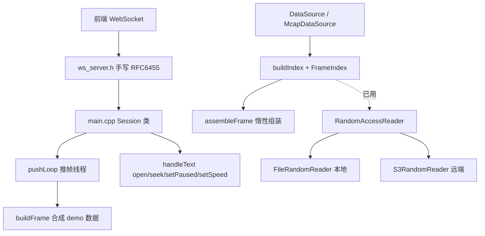
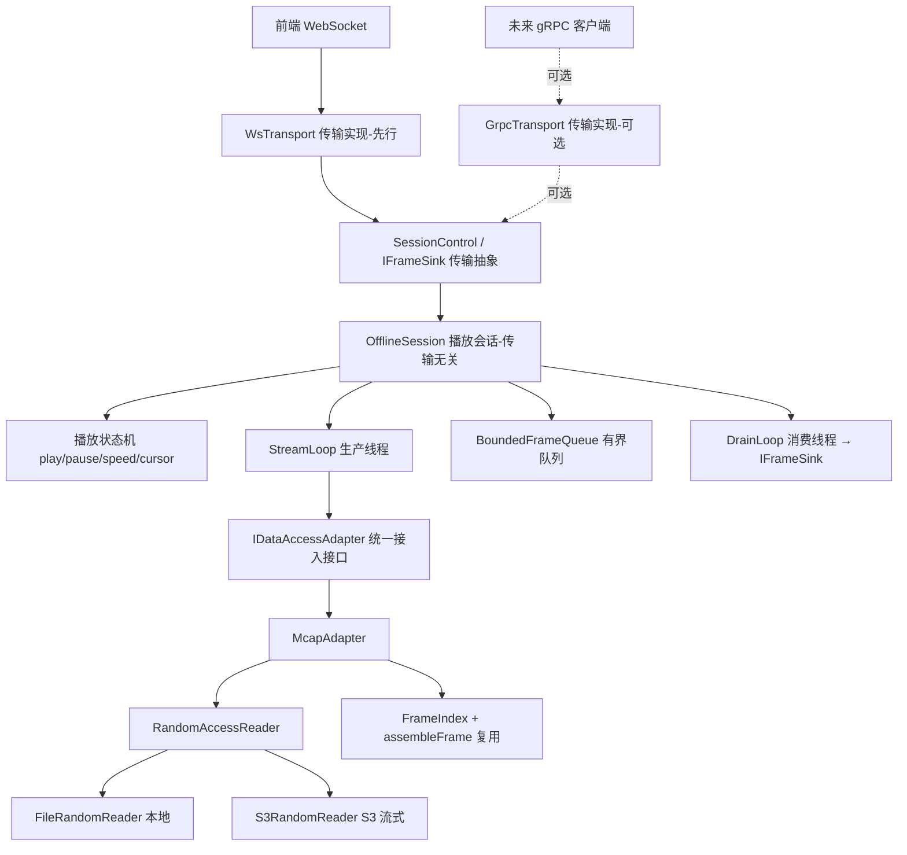

# threejs-viz 后端重构方案设计

> 状态：**方案设计（待确认）** — 本文档不含代码改动，确认后再实施。
> 参考：`/home/thor/code/xmonitor/streamer/doc/requirements_v1.3.2.md`（企业级三层架构）
> 参考实现：`xmonitor/streamer/service/entity/offline_session`

---

## 1. 目标与边界

用户明确的两点需求：

1. **统一数据接入层**：MCAP 本地读取与 S3 流式读取采用**相同接口**。
2. **离线播包模式采用 OfflineSession**：参考 xmonitor 的 `offline_session`。

### 首要原则：依赖简单、易维护（贯穿全设计）

`/home/thor/code/xmonitor/streamer/` 依赖大量 xmonitor 与 ROVER5.0 的**内部/专有**三方库（Redis、Kafka、专有消息框架、公司基础库等）。**本项目明确要求依赖关系简单、易维护**，因此参考 xmonitor 时**只借鉴其架构思想与会话结构，绝不搬运其内部依赖栈**。

**"依赖简单"不等于"绝对零依赖"** —— 判据是依赖的**性质**而非数量：

| 类型 | 态度 | 例 |
|---|---|---|
| 成熟、公开、社区广泛维护的通用库 | ✅ 可采用 | **FFmpeg**（视频/图像编解码）、protobuf、nlohmann/json、zstd/draco（点云/压缩） |
| xmonitor/ROVER5.0 内部或公司专有库 | ❌ 拒绝 | 专有消息框架、公司基础库、内部 RPC/注册中心封装 |
| 重型分布式基础设施（无本项目需求） | ❌ 不引入 | Redis 注册中心、Kafka |

落地准则：
- **只借设计，不借专有库**：OfflineSession 的状态机、生产/消费线程、有界队列背压等**思路**照搬，用标准库 `std::thread`/`std::atomic`/自实现队列重写，不 include 任何 xmonitor/ROVER 头文件。
- **成熟公开库按需采用**：如需视频解码/转码，直接用 **FFmpeg**，无须自造轮子；选型优先社区成熟、License 友好、构建集成简单的通用库。
- **可选/重量级能力用编译开关隔离**：非核心链路的依赖（如 gRPC 传输、FFmpeg 视频、点云压缩 draco/zstd）用 `VIZ_ENABLE_*` 开关，默认 OFF，不启用则依赖不进构建，核心播包链路保持轻量。
- **判断标准**：新增依赖前先问"是否成熟公开、维护成本可控、构建集成简单？"——通用成熟库可用，专有/重型基础设施不引入，能用标准库轻量实现的优先自实现。

### 边界裁剪（关键假设，需确认）

xmonitor `requirements_v1.3.2.md` 是完整企业级三层架构（网关层 → gRPC 数据服务层 → 5 种适配器 + Redis 注册中心 + Kafka + 4 层背压 + Session 三层生命周期防护）。当前 threejs-viz 后端是**零依赖 C++ + 手写 WebSocket** 的轻量实现。

本方案**保持零依赖**，仅落地用户明确的两点，其余按"可扩展预留"处理：

| 目标文档能力 | 本次重构 | 说明 |
|---|---|---|
| 统一数据接入层（适配器） | ✅ 落地 | `IDataAccessAdapter` + `McapAdapter` |
| OfflineSession 离线播放 | ✅ 落地 | 播放状态机 + 生产线程 + 有界队列 |
| Seek / 变速 / 暂停 | ✅ 落地 | 收敛现有 main.cpp 散落逻辑 |
| 背压有界队列 | ✅ 简化落地 | `BoundedFrameQueue`（无 gRPC 流控） |
| 服务实体与传输解耦 | ✅ 落地 | 服务实体传输无关，`ITransport`/`IFrameSink` 抽象 |
| WebSocket 传输 | ✅ 落地（先行） | 现有 ws_server 封装为一种传输实现 |
| gRPC 传输 | ⏸️ 可选/预留 | 同一服务实体可挂 gRPC 双向流；引入 gRPC 依赖时才启用，本次不实现 |
| Redis 注册中心 / Kafka | ❌ 不做 | 无分布式需求 |
| 仿真 / 实车 / 视频适配器 | ❌ 不做 | 接口预留，本次只实现 MCAP |
| 多源时序对齐 / 自适应降级 | ❌ 不做 | 预留 |

### 数据传输协议：坚持 frame.proto，不用 data_view.proto（核心原则）

**重构必须继续基于本项目的 [`public/frame.proto`](public/frame.proto:1)（= [`server/viz-core/proto/frame.proto`](server/viz-core/proto/frame.proto:1)），绝不引入 xmonitor 的 `data_view.proto`。**

- **frame.proto 是通用/可扩展协议**：帧内容用 `map<string, LayerData>` + 通用 `GeometryKind`（POINT/LINESTRIP/BOX/POLYGON/TEXT/ARROW/PLANNING_TRAJECTORY）+ `GeometryItem`，配合 `decoder.json` / `decoder_lightmap.json` 配置驱动解码。新增显示需求时**改配置或加一个几何类型**即可，无需为每种业务实体改协议。
- **data_view.proto 是写死协议**：xmonitor 把每类显示内容固化为具体字段/消息，用户每加一种显示就要改 proto —— 本项目明确不采用这种模式。
- **落地约束**：`IDataAccessAdapter::ReadFrame` 输出的类型是 `model::Frame`（即 frame.proto 的 `viz.Frame`）；`OfflineSession` → WebSocket 下发的仍是序列化后的 `viz.Frame`；参考 xmonitor OfflineSession 时，只借鉴其**播放会话结构**（状态机/生产消费线程/背压），`FrameViewTable`「原始消息 → data_view proto」这一环**替换为本项目「原始消息 → frame.proto（现有 assembleFrame + decoder.json 配置驱动）」**，不照搬其 proto。

### 全链路 JSON 配置驱动：重构后必须完整保留（已验证通过）

当前项目的 **channel 选择、数据字段解码、显示样式、显隐控制按钮树** 全部由 JSON 配置驱动，且已在现网验证通过。**重构不得改变这套配置机制，也不得把任何已配置项硬编码。** 清单：

| 配置文件 | 职责 | 消费方 |
|---|---|---|
| [`server/configs/decoder.json`](server/configs/decoder.json) | 高精模式（FRAME_MAP）：topic/channel、字段路径、几何类型、样式、坐标系 | 后端 `DecoderConfig::fromJson` → `buildIndex`/`assembleFrame` |
| [`server/configs/decoder_lightmap.json`](server/configs/decoder_lightmap.json) | 轻图模式（FRAME_ODOM）：同上 | 同上 |
| [`server/configs/s3.json`](server/configs/s3.json) | S3 endpoint/region/凭证/cacheDir | `s3::configFromJson` |
| [`public/layer_tree.json`](public/layer_tree.json) | 显隐控制按钮树 + 地图图层展示名 labels | 前端 `LayerPanel` |
| [`public/obstacle_colors.json`](public/obstacle_colors.json) | 障碍物 type → 名称 + 颜色（单一来源） | 前端 `frameCodec.ts` |

**落地约束**：
- 重构后 `McapAdapter` / `OfflineSession` 仍经 `DecoderConfig`（由 decoder*.json 装载）驱动解码，字段/topic/几何/样式/坐标系不写死。
- 前端 `layer_tree.json`（显隐按钮）/ `obstacle_colors.json` 零改动（协议不变，前端整体零改动）。
- 高精/轻图两套 decoder 的选择与现状一致（`resolveDataMode` 高精优先于轻图）。

### 多原始数据支持：数据 Profile 注册表（配置驱动的自定义解析）

**需求**：后端要同时支持**多种不同的原始 MCAP 数据**——都是 MCAP 容器，但内部数据协议/字段/topic 命名各不相同（不同供应商、不同车型、不同采集版本）。后端须**为不同数据加载不同的 JSON 配置**来自定义解析，而非硬编码。

**现状（待泛化）**：目前 [`server.cpp`](server/platform/web/server.cpp:504) 的 `detectDecoderPath` 把识别逻辑写死为两条分支——探到 `/localization/global_location` → `decoder.json`（高精），探到 `/map/lite_definition_map` → `decoder_lightmap.json`（轻图），探针 topic 与 decoder 路径都是 `static constexpr` 常量。**每新增一种原始数据就要改 C++ 代码，违背配置驱动原则。**

**目标：把「识别规则 + decoder 映射」也下沉到 JSON**，用一份 **profile 注册表**（如 `configs/data_profiles.json`）声明任意多套数据 profile：

```jsonc
// configs/data_profiles.json —— 数据 profile 注册表（可扩展任意多套）
{
  "profiles": [
    {
      "name": "rover_highprec",
      "decoder": "configs/decoder.json",
      "match": { "topics_any": ["/localization/global_location"] },  // 命中任一 topic 即选此 profile
      "priority": 100
    },
    {
      "name": "rover_lightmap",
      "decoder": "configs/decoder_lightmap.json",
      "match": { "topics_any": ["/map/lite_definition_map"] },
      "priority": 90
    },
    {
      "name": "vendorB_v2",       // 新供应商：只加配置，不改代码
      "decoder": "configs/decoder_vendorB.json",
      "match": { "topics_all": ["/vendorB/ego", "/vendorB/objects"] },
      "priority": 80
    }
  ],
  "fallback": "configs/decoder.json"   // 无 profile 命中时的兜底
}
```

**选择算法**（替代硬编码 `detectDecoderPath`）：
1. `VIZ_DECODER_CONFIG` 环境变量显式指定 → 最高优先（调试/定制，保留现状）。
2. 否则 `open` 时扫描 MCAP 的 topic 集合，遍历注册表，按 `match` 规则（`topics_any` 命中任一 / `topics_all` 全部命中）筛出候选，取 `priority` 最高者。
3. 都不命中 → `fallback`。

**落地约束**：
- 识别规则（探针 topic）与 decoder 路径**全部来自 `data_profiles.json`**，C++ 不再出现任何 `static constexpr` 探针常量或固定 decoder 路径。
- 每套原始数据的字段/几何/样式/坐标系解析仍由各自 `decoder_*.json`（`DecoderConfig`）驱动——本节只泛化「选哪套 decoder」，不改「decoder 内部如何解析」。
- 向后兼容：不提供 `data_profiles.json` 时，退化为现有高精/轻图两套内建规则（保证现网不回归）。
- 该注册表两种部署形态共用；`resolveDataMode` 的高精/轻图判定可保留为其中两条 profile 的等价实现。

### frame.proto 扩展：新增点云支持（PointCloud）

现状 `viz.Frame` 已支持 `map<string, Image> images`（图像）。本次需**扩展点云**。用现有 `GeometryItem.points`（`repeated Vec3`）表达大规模点云会造成消息膨胀与解码低效，故新增专用消息：

```proto
// 点云（一个通道一帧）。为紧凑传输，坐标用打平的 float 数组，非 repeated Vec3。
message PointCloud {
  repeated float xyz = 1 [packed = true];   // 打平坐标 [x0,y0,z0, x1,y1,z1, ...]，长度 = 3*N
  repeated float intensity = 2 [packed = true]; // 可选：每点强度，长度 0 或 N
  uint32 point_count = 3;                   // N（校验用）
  double t = 4;                             // 采集时间戳（秒），可选
  // 可选压缩：为空表示上面字段即原始 float；非空表示 xyz/intensity 为压缩字节，需按 encoding 解压。
  string encoding = 5;                      // "" | "draco" | "zstd" 等（预留）
}

message Frame {
  // ... 现有字段 1..7 保持不变 ...
  map<string, PointCloud> point_clouds = 8; // key = 通道名（如 "lidar_top"）
}
```

要点：
- **不动现有字段编号 1..7**，点云用新 field 8，向后兼容。
- **packed float 数组**而非 repeated Vec3：N 万级点时消息体显著更小、解码更快；前端可直接喂 `Float32Array` → Three.js `BufferGeometry` 的 `position` attribute。
- **encoding 预留**：先支持原始 float，压缩（draco/zstd）后续按需，避免引入依赖违反零依赖约束。
- **配置驱动一致**：点云通道名、字段路径、点大小/颜色样式仍走 decoder*.json（新增 `pointCloudLayer` 配置项），显隐按钮走 layer_tree.json —— 与其他图层同一套机制。
- **三份 proto 同步**：`public/frame.proto` + `server/viz-core/proto/frame.proto` + 后端序列化模型 `server/frame_model.h` 需一致（前端 protobufjs keepCase）。

### 两种部署形态：后端同一模块兼容（Desktop 与前后端分离）

后端是同一份可执行/库，通过**运行配置**适配两种形态，代码不分叉：

| 形态 | 前端载体 | 数据源 | 说明 |
|---|---|---|---|
| **Desktop 部署** | Tauri 外壳（[`src-tauri/src/lib.rs`](src-tauri/src/lib.rs:1) 装载同一 React 前端） | **本地 + 在线（S3）** MCAP | Tauri 原生文件对话框拿本地 .mcap 绝对路径；也可播 S3 在线包 |
| **前后端分离部署** | 浏览器（独立 Web + 独立后端进程） | **仅在线（S3）** MCAP | 无本地文件系统语义，只播 S3 在线包 |

**落地约束（关键）**：
- **本地/在线的差异只落在接入层**：`IDataAccessAdapter::Open(source)` 内部判定 —— 本地路径 → `FileRandomReader`，S3 key → `S3RandomReader`。`OfflineSession`/网关层/协议对两种源**完全无感**（这正是"统一数据接入层"的价值）。
- **形态由配置/启动参数决定，非编译期分叉**：新增部署形态开关（如 `deployMode: "desktop" | "web"` 或启动参数/环境变量），**web 形态下禁用本地路径接入**（`Open` 对本地路径直接拒绝，只允许 S3 key），desktop 形态两者都允许。同一二进制两种形态复用。
- **S3 能力两形态共用**：`s3.json`（endpoint/region/凭证/cacheDir）在两种形态下都生效；desktop 形态的 `cacheDir` 命中本地缓存即走本地读，未命中回落 S3 range —— 现有逻辑天然满足"desktop 支持本地+在线"。
- **Tauri 侧维持纯外壳**：[`src-tauri`](src-tauri/src/lib.rs:1) 仍只装载前端 + 放开文件对话框；后端作为独立进程（desktop 下本机 `127.0.0.1:8080`，与记忆中"Tauri WS 地址须绝对化"一致）。本次重构不改变 Tauri 外壳职责。

### 前端数据缓存策略：内存优先，量大用 IndexedDB，换包全清

播放采用前端帧缓存 + 本地时钟主导（现状已如此）：后端按序供数，前端把**已解码帧**缓存在浏览器侧，rAF 本地时钟按 `time` 从缓存取帧渲染，暂停/进度/速率全前端控制。本次明确并升级缓存分层策略：

| 层级 | 触发条件 | 存储 | 现状 |
|---|---|---|---|
| **内存优先** | 数据量不大（默认） | JS 内存中按时间戳升序的已解码帧数组 | 已实现：`threeEngine.ts` `cache: DecodedFrame[]` + `maxCacheFrames` LRU 裁剪 |
| **IndexedDB 可选** | 数据量大、超内存阈值 | 浏览器 IndexedDB 持久化缓存帧，避免内存溢出（OOM） | 待新增（本次设计新增点） |

**核心约束**：

- **内存优先**：帧默认缓存在浏览器内存（沿用现有有序数组 + `frameAt` 二分取帧 + `insertFrame` 有序插入）。数据量不大时不引入 IndexedDB，保持零额外复杂度。
- **数据量大时转 IndexedDB**：当缓存量超过阈值（帧数 / 估算字节数，阈值判定方式待确认）时，把冷帧下沉到 IndexedDB，热窗口（当前播放位置附近）留在内存；回看命中先查内存再查 IndexedDB。IndexedDB 为可选增强，是否启用可由配置/自适应决定。
- **换包全清（关键）**：**播放新数据包时（`open`/`openRecord`/`openByName`/`uploadFile` 或收到新 `STREAM_INFO`），必须清空之前数据包的全部缓存（内存 + IndexedDB）**，避免旧包帧污染新包。现状换包已调用 `clearCache()` 清内存（`resetPlayback`/`onInfo`/seek 未命中均已清）；本次需将 `clearCache()` 扩展为一并清空 IndexedDB 中该会话的对象存储。
- **与后端协议解耦**：缓存策略纯前端行为，后端协议（`[u8 type][u64 seq][protobuf Frame]`）与供数逻辑不变；前端在零改动原则下做最小增量（仅缓存层内部升级，`onFrame`/`frameAt`/`advance` 接口不变）。

---

## 2. 架构图

### 2.1 当前架构（重构前）



问题：`main.cpp` 的 `Session` 直接用合成 `buildFrame`，播放状态机（paused/speed/frameIdx/generation）散落在连接类里；真实数据链路 `McapDataSource`/`FrameIndex`/`assembleFrame` 与播放会话未打通。

### 2.2 目标架构（重构后）



四层职责：
- **传输层**（可插拔）：`WsTransport`（现有 `ws_server.h`，先行）/ `GrpcTransport`（可选，`VIZ_ENABLE_GRPC` 开关）。负责各自协议收发、编解码、控制指令解析。
- **传输抽象**：`SessionControl`（控制入口）+ `IFrameSink`（发帧出口）。服务实体只依赖此抽象。
- **会话层**（`OfflineSession`，传输无关）：播放生命周期、状态机、生产/消费线程、背压。
- **接入层**（`IDataAccessAdapter` + `McapAdapter`）：统一数据读取，本地/S3 透明。

---

## 3. 统一数据接入层接口

### 3.1 IDataAccessAdapter

```cpp
namespace viz::access {

enum class AccessMode {
    kRandom,      // 随机访问：离线 MCAP，支持 Seek / 变速
    kSequential,  // 顺序访问：实车 / 仿真流（预留，本次不实现）
};

struct DataSourceMeta {
    double   durationSec = 0.0;
    size_t   frameCount  = 0;
    double   frameDt     = 0.0;
    AccessMode mode = AccessMode::kRandom;
};

// 统一数据接入接口：MCAP 本地与 S3 走同一接口。
class IDataAccessAdapter {
 public:
    virtual ~IDataAccessAdapter() = default;

    // 打开数据源（本地路径 or S3 key），构建索引。
    virtual bool Open(const std::string& source) = 0;

    // 获取元信息（时长 / 帧数 / 帧率 / 访问模式）。
    virtual DataSourceMeta GetMeta() const = 0;

    // 随机访问：按帧号惰性组装单帧（复用 assembleFrame）。
    virtual bool ReadFrame(size_t frameIdx, model::Frame& out) = 0;

    // 随机访问：按时间戳定位到最近帧号（复用 FrameIndex::indexAtTime）。
    virtual size_t IndexAtTime(double timeSec) const = 0;

    // 顺序访问预留（本次 MCAP 不用）。
    virtual bool StartStream(std::function<void(model::Frame&&)>) { return false; }
    virtual void StopStream() {}

    virtual void Close() = 0;
    virtual AccessMode Mode() const = 0;
};

std::unique_ptr<IDataAccessAdapter> MakeAdapter(const std::string& source);

}  // namespace viz::access
```

### 3.2 McapAdapter（本地/S3 统一）

关键：**当前 `RandomAccessReader` 已是本地/S3 透明抽象**（`FileRandomReader` / `S3RandomReader`），`buildIndex(RandomAccessReader&, label)` 已实现"本地/S3 同逻辑真流式"。因此 `McapAdapter` 主要是**接口规整**，不是推翻重写：

```cpp
class McapAdapter : public IDataAccessAdapter {
 public:
    bool Open(const std::string& source) override {
        // 1. 判定 source 是本地路径还是 S3 key（复用 s3::S3Config.cacheDir 逻辑）。
        // 2. 构造对应 RandomAccessReader（FileRandomReader / S3RandomReader）。
        // 3. 扫描 MCAP topic 集合，经 ProfileRegistry 匹配 data_profiles.json，
        //    选出对应 decoder_*.json → 构造 DecoderConfig（自定义解析规则）。
        // 4. index_ = McapDataSource::buildIndex(*reader_, label);  // 复用现有
    }
    DataSourceMeta GetMeta() const override;             // 由 index_ 派生
    bool ReadFrame(size_t i, model::Frame& out) override {
        out = McapDataSource::assembleFrame(index_, i);  // 复用现有
        return true;
    }
    size_t IndexAtTime(double t) const override { return index_.indexAtTime(t); }
    AccessMode Mode() const override { return AccessMode::kRandom; }
 private:
    std::unique_ptr<RandomAccessReader> reader_;
    FrameIndex index_;
    McapDataSource source_;
};
```

**本地 vs S3 的唯一差异收敛在 `Open()` 里选哪个 reader**，其余（索引、组装、Seek）完全一致 —— 这正是"统一接入"的落点。

---

## 4. OfflineSession 设计

对齐 xmonitor `OfflineSession`，零依赖简化：

```cpp
// OfflineSession 实现 SessionControl，经 IFrameSink 出帧，传输无关。
class OfflineSession : public viz::transport::SessionControl {
 public:
    OfflineSession(std::unique_ptr<IDataAccessAdapter> adapter,
                   viz::transport::IFrameSink* sink);  // sink 由传输层注入

    void Open(const std::string& source) override;  // 打开、发 StreamInfo、启动 StreamLoop
    void Seek(double timeSec) override;              // 定位（对齐 handleText "seek"）
    void SetPaused(bool paused) override;            // 暂停/继续
    void SetSpeed(double speed) override;            // 变速
    void Close() override;                           // 停线程、释放

 private:
    void StreamLoop();                 // 生产线程：按状态机取帧 → 入队
    void DrainLoop();                  // 消费线程：出队 → sink_->SendFrame（背压解耦）

    std::unique_ptr<IDataAccessAdapter> adapter_;
    viz::transport::IFrameSink* sink_;  // 传输出口，不感知 WS/gRPC

    // 播放状态机（对齐 xmonitor play_state_/speed_factor_/cursor/frame_index）
    std::atomic<bool>   paused_{true};
    std::atomic<double> speed_{1.0};
    std::atomic<size_t> frameIdx_{0};
    std::atomic<uint64_t> generation_{0};   // seek 后自增，丢弃旧帧
    std::atomic<bool>   pendingSeek_{false};

    BoundedFrameQueue queue_;           // max 32，满则阻塞（Layer2 背压）
    std::thread producer_, consumer_;
    std::atomic<bool> stopped_{false};
};
```

组件与 xmonitor 的对应关系：

| xmonitor OfflineSession | 本方案 | 复用现有 |
|---|---|---|
| `data_reader_` (IDataAccessAdapter) | `adapter_` | ✅ McapAdapter |
| `FrameViewTable`（消息→proto） | `assembleFrame` | ✅ 现有（输出 frame.proto，非 data_view.proto） |
| `PlaybackTransformManager` | `FrameIndex` 坐标变换字段 | ✅ 现有 |
| `StreamLoop` 生产线程 | `StreamLoop` | 收敛 main.cpp pushLoop |
| `StreamDrainLoop` 消费线程 | `DrainLoop` | 新增（背压解耦） |
| `BoundedFrameQueue`(max32) | `BoundedFrameQueue` | 新增（简化） |
| `pending_seek_` | `pendingSeek_` | 迁移现有 generation 机制 |
| gRPC notify_cb | `IFrameSink` 抽象（WsTransport 实现先行，gRPC 可选） | 解耦 |
| SessionFactory/生命周期三层防护 | 暂不做 | 预留 |

---

## 4.5 传输层与服务实体解耦（WebSocket 先行，gRPC 可选）

**核心原则**：后端拆成**服务实体层**（传输无关）与**传输层**（可插拔）。同一个 `OfflineSession` 既可通过 WebSocket 暴露，也可通过 gRPC 暴露，服务实体本身不 include 任何传输头文件。

### 4.5.1 分层职责

| 层 | 组件 | 是否依赖传输 |
|---|---|---|
| 服务实体层 | `OfflineSession` + `IDataAccessAdapter`（McapAdapter） | ❌ 传输无关 |
| 传输抽象 | `IFrameSink`（发帧出口）+ `SessionControl`（控制指令入口） | 接口，无实现依赖 |
| 传输层（可插拔） | `WsTransport`（先行）/ `GrpcTransport`（可选） | ✅ 各自依赖 |

### 4.5.2 传输抽象接口

```cpp
namespace viz::transport {

// 发帧出口：OfflineSession 经此把帧/流信息/错误推给外界，不关心底层是 WS 还是 gRPC。
struct IFrameSink {
    virtual ~IFrameSink() = default;
    virtual void SendFrame(uint64_t seq, const std::string& framePayload) = 0; // 序列化后的 frame.proto
    virtual void SendStreamInfo(const std::string& infoPayload) = 0;
    virtual void SendError(const std::string& msg) = 0;
    virtual bool Alive() const = 0;   // 连接是否存活（供生产线程判断退出）
};

// 控制指令入口：传输层解析各自协议后，统一调用服务实体。
// WsTransport 解析 JSON handleText → 调用；GrpcTransport 解析 request → 调用。
struct SessionControl {
    virtual ~SessionControl() = default;
    virtual void Open(const std::string& source) = 0;
    virtual void Seek(double timeSec) = 0;
    virtual void SetPaused(bool paused) = 0;
    virtual void SetSpeed(double speed) = 0;
    virtual void Close() = 0;
};

}  // namespace viz::transport
```

`OfflineSession` 实现 `SessionControl`，持有 `IFrameSink*`（替代原 `FrameSink` 回调），彻底不感知传输协议。

### 4.5.3 两种传输实现

- **WsTransport（先行落地）**：现有 `ws_server.h` + `main.cpp` 的 `Session` 收敛为此实现。
  - `handleText` 解析 open/seek/setPaused/setSpeed → 转调 `SessionControl`。
  - 实现 `IFrameSink`：`SendFrame` = 现有 `[u8 type][u64 seq][protobuf]` 二进制帧写 socket。
- **GrpcTransport（可选/预留）**：对齐 xmonitor `DataService` 双向流。
  - server-streaming 把 `SendFrame` 映射为流式 `ReadFrames` 响应。
  - client 消息映射为 `SessionControl` 调用。
  - **仅当引入 gRPC 依赖时才编译此实现**（CMake/Bazel 用开关 `VIZ_ENABLE_GRPC` 隔离，默认 OFF，保持零依赖）。

### 4.5.4 与部署形态的关系

传输选择与部署形态正交：Desktop 与前后端分离**默认都用 WsTransport**；gRPC 传输是面向未来服务化的可选扩展，不影响两种部署形态的现网行为。

---

## 5. 改造步骤（分阶段，每步可编译验证）

### 阶段 A：接入层（不改行为，纯抽象规整）
1. 新增 `server/viz-core/include/viz/access/data_access_adapter.h`：`IDataAccessAdapter` + `AccessMode` + `DataSourceMeta`。
2. 新增 `server/viz-core/src/access/mcap_adapter.{h,cpp}`：`McapAdapter` 包装 `RandomAccessReader` + `buildIndex` + `assembleFrame`（**全部复用**）。
3. 新增 `MakeAdapter(source)`：判定本地/S3，选 reader。
3b. 新增 `server/viz-core/src/config/profile_registry.{h,cpp}`：`ProfileRegistry::fromJson("configs/data_profiles.json")` + `Select(topics)` → decoder 路径；替代 `server.cpp` 硬编码的 `detectDecoderPath`（无注册表时退化为现有高精/轻图两内建规则）。✅ 已完成：注册表落地在 `McapAdapter::detectDecoderPath`（优先级：VIZ_DECODER_CONFIG > data_profiles.json > 内建高精/轻图退化）；配置样例 `server/configs/data_profiles.json`；端到端冒烟验证 `[profiles] selected 'light_map'`。
4. 更新 `server/viz-core/BUILD.bazel` 加入新文件。
5. **验证**：bazel 构建通过，`McapAdapter` 可独立读一帧；给定 topic 集合 `ProfileRegistry` 选出正确 decoder。

### 阶段 B：OfflineSession（收敛播放逻辑）
6. 新增 `server/viz-core/src/session/offline_session.{h,cpp}`：状态机 + StreamLoop + DrainLoop + BoundedFrameQueue。
7. 迁移 `main.cpp` 中 `pushLoop`/`open`/`seek`/`setPaused`/`setSpeed`/`generation` 逻辑到 `OfflineSession`。
8. **验证**：bazel 构建通过。

### 阶段 C：网关/传输层对接
9. 定义传输抽象 `IFrameSink` + `SessionControl`（`server/viz-core/include/viz/transport/transport.h`），`OfflineSession` 实现 `SessionControl`、持有 `IFrameSink*`。
10. 精简 `main.cpp` 的 `Session` 为 **WsTransport**：只保留 WebSocket 收发 + 控制指令解析，open/seek/setPaused/setSpeed 转发给 `OfflineSession`（`SessionControl`）；实现 `IFrameSink::SendFrame` = 现有 `sendFrameMsg`。
11. 移除合成 `buildFrame` 主链路（保留 demo 作为可选降级）。
12. **验证**：bazel 构建 + 端到端连前端播 MCAP，Seek/暂停/变速正常。
13. **（可选/预留）GrpcTransport**：仅当引入 gRPC 依赖时，用 `VIZ_ENABLE_GRPC` 开关新增 gRPC 传输实现，复用同一 `OfflineSession`；本次不实现。

### 阶段 D：清理
12. 删除/归并散落状态；补注释。
13. **验证**：npm 前端无需改动（协议不变）；后端 bazel 重构生效。

---

## 6. 风险与注意

- **协议不变**：WebSocket msgType（FRAME=1..CHART_DEFS=6）与 FRAME 帧格式 `[u8 type][u64 seq LE][proto]` 保持不变，前端零改动。
- **协议基于 frame.proto**：数据内容协议坚持通用可扩展的 `viz.Frame`（frame.proto + decoder.json 配置驱动），**不引入 xmonitor 写死的 data_view.proto**；参考 xmonitor 只取其播放会话结构，不取其 proto。
- **零依赖约束**：默认不引入 gRPC/Redis/Kafka；线程用 std::thread，队列自实现。gRPC 仅作可选传输，用 `VIZ_ENABLE_GRPC` 开关隔离，默认 OFF；不启用时不引入任何 gRPC 依赖，零依赖不破。
- **服务实体与传输解耦**：`OfflineSession` + `IDataAccessAdapter` 为传输无关服务实体，只依赖 `IFrameSink`/`SessionControl` 抽象；WsTransport 先行落地，GrpcTransport 为同一服务实体的可选传输，本次预留不实现。
- **复用优先**：`FrameIndex` 惰性组装 + `assembleFrame` + `RandomAccessReader` 本地/S3 透明**已是良好设计**，重构是"规整接口 + 收敛播放状态机"，不推翻。
- **只借鉴 xmonitor 结构、不引入其专有依赖**：xmonitor/ROVER5.0 依赖 Redis/Kafka/专有消息框架/公司基础库等内部库；本项目要求依赖简单、易维护，仅照搬其会话结构与线程/背压思路（用标准库自实现），不 include 任何 xmonitor/ROVER 头文件或链接其库。**成熟公开的通用库（如 FFmpeg 做视频编解码、zstd/draco 做压缩）可按需采用**，非核心链路用 `VIZ_ENABLE_*` 开关隔离。
- **C++ 改动需 bazel 重构生效**。
- **generation 机制**：现有用 `(gen<<32)|idx` 做 seek 后丢弃旧帧，迁移到 OfflineSession 时保留。
- **JSON 配置驱动保留**：channel/字段/样式/显隐树全部继续由 decoder*.json + layer_tree.json + obstacle_colors.json 驱动，重构不得硬编码任何已配置项。
- **多原始数据 Profile 注册表**：不同 MCAP 原始数据（协议/字段/topic 不同）经 `configs/data_profiles.json` 声明识别规则(探针 topic)+decoder 映射，`open` 时按 topic 自动选 profile 加载对应 decoder；新增数据只加配置不改代码。`server.cpp` 现有硬编码 `detectDecoderPath`(两 constexpr 探针)须下沉为配置；无注册表时退化为现有高精/轻图规则，不回归。
- **点云扩展**：frame.proto 新增 `map<string, PointCloud> point_clouds = 8`（packed float），不动现有字段编号；三份 proto 同步；前端加点云渲染 + decoder*.json 加点云配置项。
- **两种部署形态**：同一后端二进制兼容 desktop（本地+S3）与前后端分离（仅 S3）；差异只在接入层 `Open` 的路径判定 + 部署开关（web 禁用本地路径）；Tauri 保持纯外壳。
- **前端数据缓存**：内存优先（现有有序数组 + LRU），数据量大时可选下沉 IndexedDB 防 OOM；**换包必须全清旧缓存（内存 + IndexedDB）**，现有 `clearCache()` 需扩展清 IndexedDB。缓存纯前端行为、后端协议不变，前端做最小增量。

---

## 7. 待确认问题

1. 接入层接口名 / 命名空间（`viz::access::IDataAccessAdapter`）是否可接受？
2. 是否需要 `DrainLoop` 双线程背压解耦，还是先单线程生产+发送（更简单）？
3. 是否保留合成 `buildFrame`作为无数据源时的降级演示？
4. 点云消息 `PointCloud`：本次先做「原始 packed float」即可，还是需预留/实现 draco/zstd 压缩（会引入第三方依赖，与零依赖约束冲突，倾向暂不实现只留 encoding 字段）？
5. 点云按通道名放 `map<string, PointCloud>`、通道名/点大小/颜色样式沿用 decoder*.json + layer_tree.json 配置（倾向：是），是否认可？
6. 部署形态开关用哪种方式：启动参数（如 `--deploy=web|desktop`）、环境变量（如 `VIZ_DEPLOY_MODE`）还是配置文件字段（倾向：环境变量 + 启动参数覆盖，web 形态拒绝本地路径接入）？
7. 传输层解耦方案（服务实体 `OfflineSession` 传输无关，经 `IFrameSink`/`SessionControl` 抽象；WsTransport 先行，GrpcTransport 用 `VIZ_ENABLE_GRPC` 开关可选、本次预留不实现）是否认可？gRPC 传输是否需要在本次一并实现，还是仅做接口预留？
8. 多原始数据的 profile 注册表（`configs/data_profiles.json` 声明「探针 topic 匹配规则 + decoder 路径 + priority」，`open` 时按 MCAP topic 自动选 decoder，替代硬编码 `detectDecoderPath`）方案是否认可？匹配规则以 topic 集合（`topics_any`/`topics_all`）为准是否够用，还是需支持按 schema 名 / channel 元数据匹配？
9. 前端缓存策略（内存优先、数据量大转 IndexedDB、换包全清）是否认可？内存 → IndexedDB 的阈值判定用哪种方式：帧数（如超过 `maxCacheFrames`）、估算字节数，还是自适应监测内存压力？IndexedDB 缓存是默认自适应启用还是配置开关控制？